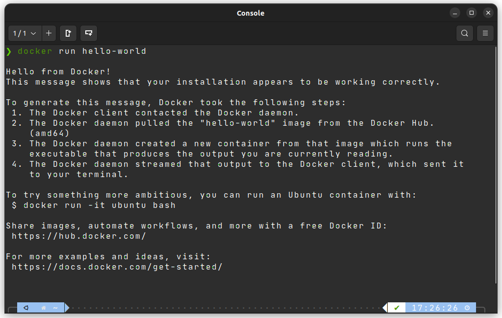
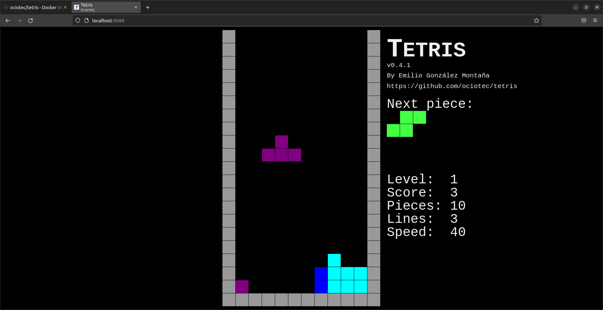

# Instalación correcta de Docker


<details close>
 <summary> <h2>¿Qué es Docker? </h2>  </summary> 

Docker es un proyecto de código abierto, que utiliza el kernel de Linux, utilizado principalmente para la automatización del despliegue de aplicaciones. 

</details>

*Para comprobar el buen funcionamiento de Docker se procede a correr algunas imagenes de [Docker Hub](https://hub.docker.com/).*

## **hello-world**

---

Para descargar una imágen ya diseñada de Docker Hub se usa `docker pull`. Para descargar la imágen de `hello-world` se ejecuta lo siguiente: 

```docker
docker pull hello-world
```

Y para que se ejecute el proceso del contenedor de manera aislada se usa `docker run`. Para ejecutar la imágen `hello-world` se hace lo siguiente: 

```docker
docker run hello-world
```

Obteniendo el siguiente resultado: 



## **Docker Funbox**

---

Para descargar la imágen y estartearla utilizamos los siguientes comandos:
```docker
docker pull wernight/funbox
```

```docker
docker run --rm -it wernight/funbox
```

Y obtenemos lo siguiente:


## **Docker Funbox**

---

Para descargar la imágen y estartearla utilizamos los siguientes comandos:

```docker
docker pull ociotec/tetris
```

El siguiente comando lanza el proceso en el puerto 8888 de nuestra máquina: 

```docker
docker run --name tetris --detach --publish 8888:80 --restart always ociotec/tetris
```

Si vamos a nuestro navegador y vamos al `localhost:8888`:



## Referencias

- [¿Qué es DOCKER?](https://www.redhat.com/es/topics/containers/what-is-docker )

- [Docker Funbox imágen](https://hub.docker.com/r/wernight/funbox)

- [hello-world imágen](https://hub.docker.com/_/hello-world)

- [ociotec/tetris imágen](https://hub.docker.com/r/ociotec/tetris)

